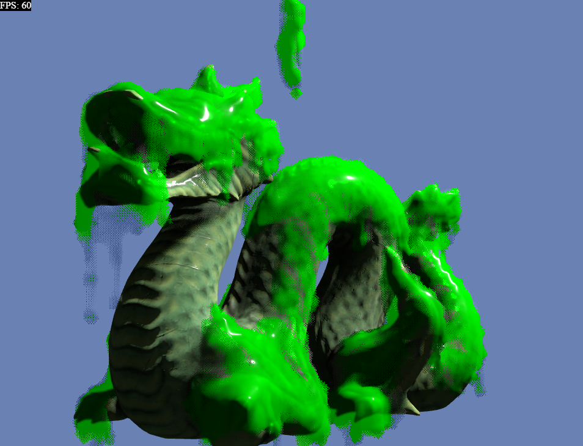

# Project Title

Goo Simulator

## Description

In this simulation, the goo substance is represented by a collection of particles or vertices connected by springs, forming a flexible and deformable structure. The Three.js library is used to render and animate the goo, allowing users to interact with it in real-time.

The Three-BVH-Mesh algorithm, short for Bounding Volume Hierarchy Mesh, is employed for efficient collision detection within the simulation. This algorithm partitions the goo's mesh into a hierarchical tree structure, enabling fast and accurate detection of collisions with other objects or surfaces within the environment.

## Live Demo

Press the left or right arrow keys to rotate the model around the y-axis.
Press the up or down arrow keys to rotate the model around the x-axis.

https://rawcdn.githack.com/danborutori/goo_simulator/3a3f67cc58522a2a10b8886c1db1b3a4b4429a85/html/index.html

## Credit
"Stanford Dragon PBR" (https://skfb.ly/otyzN) by hackmans is licensed under Creative Commons Attribution (http://creativecommons.org/licenses/by/4.0/).